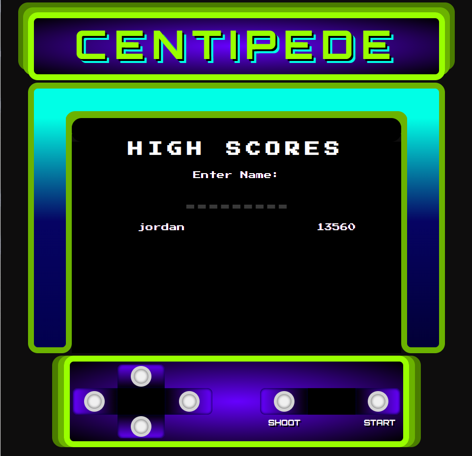

# Centipede

## Technologies Used

- HTML
- CSS
- JavaScript
- Canvas

## Overview

Remake of the classic Centipede arcade game made with canvas. The game features a keyboard button controlled player character with the ability to fire projectiles at enemies and obstacles in the environment. Game also keeps track of available player lives and score.

## User Stories

As a user, I want the ability to:
* input name to save score
* move character with keyboard input (WASD or arrow keys)
* fire projectiles
* damage the environment
* destroy enemies (for varying amounts of points depending on the enemy type)
* change the player character and environment color upon beating a level
* keep track of which level I'm on

## Screenshots

